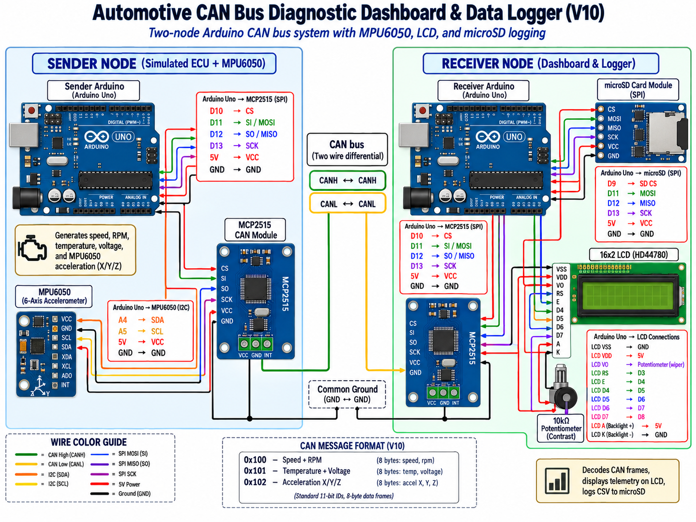

# CAN Bus Diagnostic Dashboard

Arduino-based automotive telemetry project using two Arduino Uno boards and MCP2515 CAN modules.

## System Overview

**Figure:** V10 two-node Arduino CAN bus diagnostic dashboard and data logger.  
The sender node simulates vehicle telemetry and reads MPU6050 acceleration data, then transmits CAN frames to the receiver node.  
The receiver node decodes CAN messages, displays telemetry on a 16x2 LCD, and logs CSV data to a microSD card.

## Features

- Simulated vehicle speed, RPM, coolant temperature, and battery voltage
- CAN communication between sender and receiver
- MPU6050 acceleration sensing over I2C
- SPI communication with MCP2515 and microSD card
- CSV telemetry logging to microSD
- Checksum generation
- Warning LED
- 16x2 LCD display

## Hardware

- 2x Arduino Uno
- 2x MCP2515 CAN modules
- MPU6050 accelerometer
- microSD card module
- 16x2 LCD
- LED
- Breadboard and jumper wires

## Communication

- CAN: sender-to-receiver vehicle telemetry transmission
- SPI: Arduino to MCP2515 and microSD card
- I2C: Arduino to MPU6050
- UART: Serial Monitor debugging

## CAN Message Format

| CAN ID | Payload | Length |
|---|---|---:|
| `0x100` | Speed + RPM | 3 bytes |
| `0x101` | Temperature + Voltage | 4 bytes |
| `0x102` | Acceleration X / Y / Z | 6 bytes |

## Development

- V1 - Simulated vehicle telemetry
- V2 - CSV telemetry output
- V3 - microSD CSV logging
- V4 - Checksum
- V6 - Warning LED
- V7 - LCD dashboard
- V8 - CAN loopback testing
- V9 - CAN sender and receiver
- V10 - MPU6050 I2C integration and acceleration data transmission over CAN
